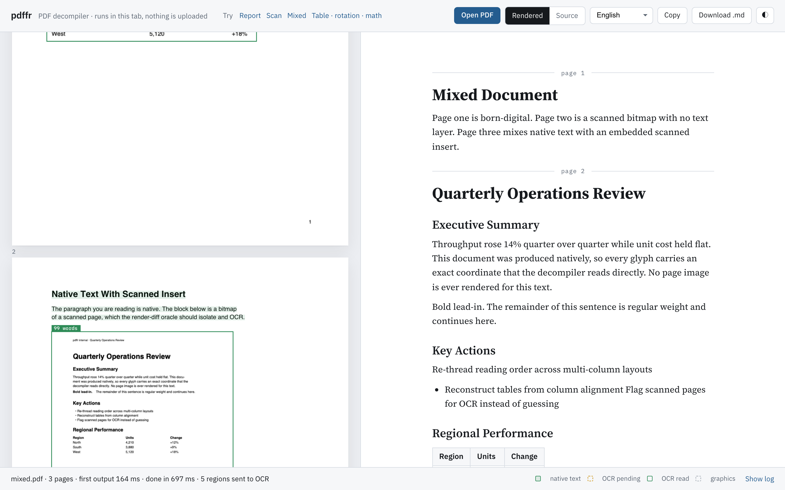

# pdffr

[](https://github.com/AmerSarhan/PDFFR/actions/workflows/ci.yml)
[](https://www.npmjs.com/package/pdffr)
[](LICENSE)

**A PDF decompiler, not an image reader.** PDF → Markdown in the browser or Node, in milliseconds for born-digital pages — with on-device OCR spent only on the pixels the text layer can't explain.

**[Try it in your browser →](https://amersarhan.github.io/PDFFR/)** — drop any PDF; it never leaves the tab.

[](https://amersarhan.github.io/PDFFR/)

```ts
import { decompile } from 'pdffr';

const { markdown, stats } = await decompile(file);
// stats.firstOutputMs ≈ 150ms for a typical report; the file never leaves the tab
```

```bash
npx pdffr report.pdf -o report.md
```

## Why this exists

Every PDF→Markdown tool sits at one of two extremes:

| Approach                                                  | Speed             | Quality | Problem                                                                                                               |
| --------------------------------------------------------- | ----------------- | ------- | --------------------------------------------------------------------------------------------------------------------- |
| Text-layer extraction (pdfminer, pdf.js `getTextContent`) | instant           | poor    | PDF has no paragraphs, headings, tables or reading order — you get a soup of positioned strings                       |
| Render + OCR / vision model (Textract, LlamaParse, VLMs)  | slow, paid, cloud | high    | Rasterizes a page that was _already digital_, then asks a model to re-read pixels the file could have told it exactly |

~80% of real-world PDFs are born-digital: every glyph's exact coordinates, size and font are already in the file. pdffr treats PDF as what it is — a drawing program — and **decompiles** the drawing back into structure:

- **Geometry-native decompilation.** Glyph runs → lines → an XY-cut reading-order tree over whitespace → headings (font-size clustering), paragraphs (leading analysis), nested lists (marker glyph + indent), tables (ruling lines from the content stream, or column x-alignment), inline `**bold**`/`*italic*`/`<sup>`, math fonts and sub/superscripts transliterated to `$LaTeX$`, rotated text re-framed upright, running header/footer stripping, hyphenation repair. No rasterization. Milliseconds per page.
- **Render-diff oracle.** When a page carries bitmaps or thin text coverage, the page is rendered once, the raster's ink mask is computed, and the dilated boxes of every native glyph are _erased_ from it. What's left is ink the text layer cannot explain — scans, stamps, screenshots with burned-in text. Exact image rectangles from the content stream (CTM-tracked) sharpen the regions further. **Only those regions** go to OCR.
- **One IR for both sources.** OCR words come back with boxes and confidence, get gated by a text-plausibility test (confidence alone lies on icons and charts), and enter the _same_ geometry engine as native glyphs. Structure recovery is source-agnostic.
- **Parallel and optimistic.** Pages decompile concurrently; markdown streams out immediately with placeholders; a pool of tesseract workers fills them in place. Whole-page scans are split along their own ink into chunks so the pool works in parallel.
- **Private by construction.** pdf.js and tesseract.js run in web workers in the user's tab. Nothing is uploaded.
- **Same engine in Node.** `pdffr/node` runs the identical pipeline on the server or the command line, with `@napi-rs/canvas` standing in for the DOM.

## Install

```bash
npm install pdffr pdfjs-dist tesseract.js
# Node / CLI additionally:
npm install @napi-rs/canvas
```

`pdfjs-dist` and `tesseract.js` are peer dependencies; `@napi-rs/canvas` is an optional peer used only by the Node entry.

## Usage

### Browser

```ts
import { decompile, warmOcr, setPdfWorkerSrc } from 'pdffr';

// Bundled apps: point pdf.js at its worker. Without this, pdffr falls back to the jsdelivr build.
setPdfWorkerSrc(new URL('pdfjs-dist/build/pdf.worker.min.mjs', import.meta.url).href);

// Optional: pre-load OCR workers while the user is still choosing a file.
warmOcr();

const result = await decompile(file, {
  ocr: true, // escalate unexplained ink to on-device OCR (default true)
  lang: 'eng', // tesseract language(s): 'deu', 'eng+ara', 'chi_sim', …
  concurrency: 4, // pages decompiled in parallel
  onPage(page, md) {
    // streams: first the native pass, then again as OCR regions land
    render(page, md);
  },
  onEvent(e) {
    // every trace line, page (re)emit, and stats update
    if (e.type === 'trace') console.log(e.kind, e.msg);
  },
});

result.markdown; // the whole document
result.pages[0].blocks; // typed blocks: heading | para | math | list | table
result.stats; // firstOutputMs, nativeDoneMs, totalMs, ocrRegions, nativeChars, ...
```

### Node

```ts
import { decompileFile, terminateOcr } from 'pdffr/node';

const { markdown } = await decompileFile('invoice.pdf', { lang: 'deu' });
await terminateOcr(); // let the process exit once the tesseract workers are done
```

### Command line

```bash
pdffr scan.pdf                    # markdown on stdout, progress on stderr
pdffr scan.pdf -o scan.md --lang eng+fra
pdffr paper.pdf --no-ocr -q       # native text only, silent
```

### API

- `decompile(input, options?) → Promise<DecompileResult>` — `input` is an `ArrayBuffer`, `Uint8Array`, `Blob` or `File`. Options: `ocr`, `lang`, `concurrency`, `pool`, `onPage`, `onEvent`, `pdfWorkerSrc`.
- `decompileFile(path, options?)` — Node only.
- `warmOcr(lang?)` / `terminateOcr()` — pre-load or shut down the shared tesseract pool.
- `ocrPool(lang?)` — the shared `OcrPool`; pass your own via `options.pool` to control worker count.
- `runPipeline(buffer, emit, { ocr, concurrency, escalate })` — the streaming core, if you want raw events.
- `blocksToMarkdown(blocks)` — render typed blocks yourself.
- `setPdfWorkerSrc(url)` — configure pdf.js's worker.

Types: `Block`, `ListItem`, `Run`, `Region`, `Rules`, `PageState`, `Stats`, `PipelineEvent`.

## Integrations

| Package                                   | What it is                                                                                                       |
| ----------------------------------------- | ---------------------------------------------------------------------------------------------------------------- |
| [`pdffr-mcp`](packages/mcp)               | MCP server for Claude Desktop / Claude Code / Cursor / any agent: `pdf_to_markdown`, `pdf_outline`, `pdf_tables` |
| [`pdffr-langchain`](packages/langchain)   | LangChain.js document loader — one Markdown `Document` per page                                                  |
| [`pdffr-llamaindex`](packages/llamaindex) | LlamaIndex.TS reader — one Markdown `Document` per page                                                          |

```json
{ "mcpServers": { "pdffr": { "command": "npx", "args": ["-y", "pdffr-mcp"] } } }
```

## How a page flows through

```
getTextContent ─► runs (x, y, w, h, size, bold, italic, math font, rotation)
                   │
getOperatorList ─► exact bitmap rects + ruling lines (CTM walk), font resolution
                   │
        suspicious? (bitmaps, or thin coverage)
             │ no                          │ yes
             ▼                             ▼
     structure pass                render page once (print intent)
                                   ink mask − native glyph boxes = residual
                                   regions = bitmap rects ∪ residual components
                                   large regions split along their ink
                                   ─► OCR pool (2×/3× upsampling for small crops,
                                      second read of doubtful words,
                                      text-plausibility gate)
                                   ─► OCR runs join the same structure pass
```

Structure pass: rotated runs re-framed upright (a dominant rotation turns the whole page; a minority is a sidebar group) → `buildLines` (math spans → LaTeX) → `orderRuns` (XY-cut: tall prose gutter → vertical cut; largest whitespace band → horizontal cut; ruled and aligned tables detected first as atomic boxes) → `toBlocks` (headings, lists with nesting, paragraphs by leading, display math, tables, furniture stripping) → markdown.

## Demo

```bash
npm install
npm run dev
```

The playground in `demo/` shows each page with the engine's decisions drawn on it — text it read straight from the file, regions it sent to OCR and what came back — beside the decompiled document. It opens on a sample report; drop any PDF onto it. Four canonical samples ship with it: a born-digital report (headings, bold runs, a list, a table, a two-column page, running header and page numbers), a full-page scan of the same report, a mixed document with a scanned insert inside native text, and one page each of a ruled table, a rotated sidebar and equations.

## Documentation

- [`docs/architecture.md`](docs/architecture.md) — the pipeline, the render-diff oracle, the shared IR, and every heuristic with its threshold and rationale.
- [`CONTRIBUTING.md`](CONTRIBUTING.md) — layout of the code, the one rule for new heuristics, how to add a test.
- [`CHANGELOG.md`](CHANGELOG.md)

## Development

```bash
npm test             # vitest: unit tests + Node end-to-end runs on the sample PDFs
npm run typecheck
npm run format
npm run build        # library to dist/, demo to dist-demo/
```

CI runs typecheck, format check, tests and the build on every push.

## Status and roadmap

Early. It is accurate on the documents it was built against (reports, Word exports with screenshots, scans, two-column layouts, ruled tables, rotated sidebars, simple equations) and will have gaps on others. What it handles today:

- Born-digital text with headings, nested lists, tables (ruled or aligned), inline styles, two-column reading order, running headers/footers, hyphenation.
- Scans and figures with burned-in text via on-device OCR, any tesseract language, with icons and chart glyphs rejected by shape and colour rather than trusted on confidence.
- Rotated pages and sidebars (multiples of 90°); skewed watermarks are dropped, not reordered.
- Math set in math fonts (Symbol, Computer Modern, STIX, Cambria Math…): Greek, operators, sub/superscripts → inline `$…$` and display `$$…$$` LaTeX.
- Browser, Node and CLI.

Also: letter-spaced headings, label columns (`**KSA-UAE tension** — paragraph` layouts become headings over their paragraphs), card/lane layouts, fractions drawn with a bar, multi-line display math, paragraphs cut by a page break, bold recovered from OCR stroke weight.

Known limitations:

- Radicals with an argument bar, matrices and `aligned` blocks are not reconstructed.
- Math typed in an ordinary upright text font (a bare `x2` with no italic or math font) is not recognised as math.
- Tables whose cells span rows or columns are flattened.
- Icons that are neither solid nor coloured (a thin grey outline) can still OCR into a character.
- OCR output carries bold (from stroke weight) but no italic.

Bug reports with a PDF attached are the fastest way to improve it.

## License

MIT © Amer Sarhan
